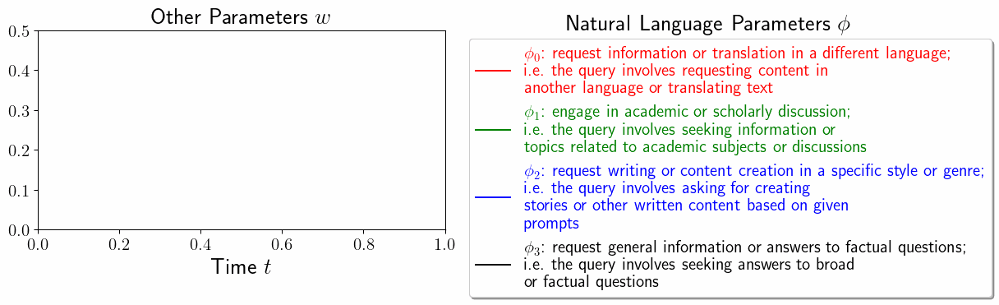

# Explaining Datasets in Words: Statistical Models with Natural Language Parameters 

Ruiqi Zhong, Heng Wang, Dan Klein, Jacob Steinhardt




Feel free to reach out to ruiqi-zhong@berkeley.edu if you have any question about the paper!

# Installation

```
cd nlparam/
pip install -r requirements.txt
pip install -e .
```

## Running Statistical Models with Natural Language Parameters

### Quick start

Run the models with the following imports:

```from nlparam import run_clustering, run_time_series, run_classification``` 

You can find the examples in the ```demo/``` folder.

### General

Our model takes in the observed text samples and the hyperparameters. It returns a ```ModelOuput```, as defined in ```nlparam/models/abstract_model.py```. The core output is ```ModelOutput.predicate2text2matching```: it is a dictionary, where the keys are all the learned natural language predicates; each predicate maps to another dictionary, which maps from a text sample x to 0/1 depending on whether x satisfies the predicate. 

### Examples

We recommend first checking out ```demo/cluster.py``` for a simple example of clustering. It clusters a small subset of the math problems in section 6.3.

If you want to use other models, you can find a demo in 
- ```demo/time_series.py```, which models the change of topics across time in our benchmark (section 5). 
- ```demo/classification.py```, which classifies a small subset of captions for the memorability dataset in section 6.2. 

If you want to evaluate our model by comparing it to some reference predicates, see ```nlparam/model/cluster_comprehensive.py```. 

## Changing LLMs, Discretizer, or Denotation Approximation

Currently our default LLM to discretize continuous predicate is ```gpt-4o``` and our default LLM to compute denotation is ```gpt-4o-mini```. The default model name is set in ```__init__.py```. If you want to use different language models, you can implement the inference in ```nlparam/llm/query.py```; if you want to use different prompts to perform these functionalities, you can modify the templates in ```nlparam/llm/template/```. If you want to change the overall logic of discretizing and validating, you can modify ```nlparam/llm/validate.py``` and ```nlparam/llm/propose.py```.

### Define and implement your own statistical model with natural language parameters

We have implemented the abstract logic for learning a model in ```nlparam/models/abstract_model.py```. You need to implement a new class, inherent from the abstract model, implement three more functions: ```optimize_w```, ```optimize_tilde_phi```, and ```compute_fitness_from_phi_denotation```. The argument type is explained in ```nlparam/models/abstract_model.py``` and you can reference to ```nlparam/models/cluster.py``` for an example. ***NOTE***: in all the models we order the ```.texts``` field to be deduplicated and sorted. 

### Datasets

The datasets are stored are a json object in ```data / ${model_type} / ${dataset_name}.json```

### Specify which language models to use

See ```python3 demo/timeseries_model.py``` for an example of specifying which language model to use as the validator and as the discretizer (named as proposer in our code). By default we used ```google/flan-t5-xl``` as the validator and ```gpt-3.5-turbo``` as the proposer, which are both cheap to run and matches the models we used in our paper. They are defined in ```nlparam/__init__.py```. Generally we don't recommend using proprietary model for validation unless you are subsidized or you are running it on a small dataset, since our system currently still needs to make a lot of calls to validators and they are quite expensive. 

### Prompt templates

The directory of prompt templates are in ```nlparam/templates```. 

### Practical Considerations

**Cost**: As of 2024/08/16, 1M tokens with K=8 clusters takes around $10 using the latest ```gpt-4o-mini``` model. So we do not recommend running it on much larger dataset.

**Speed**: The speed of clustering is okay, but the time-series mode currently is slow. There are still a lot of room for improvement here. 

### Evaluation

The logic for model evaluation is implemented in ```nlparam/models/abstract_model.py``` and the key helper functions are implemented in ```nlparam/eval_utils.py```.


## Reproducing section 5 in the paper

Run ```python3 nlparam/run_experiment.py``` to reproduce the performance of our full system from our paper. 

Use the ```--random_update``` and ```--one_hot_embedding``` flag to investigate the performance of not proposing predicates based on continuous relaxation and not using learned embeddings to approximate the denotation. The results will be saved in ```results/```.

In the paper, we used ```gpt-3.5-turbo``` to evaluate the similarity between two predicates, but this repo defaults to ```gpt-4o```, which is better at similarity judgement. You can change the default of model choice by modifying ```get_similarity_scores``` in ```eval_utils.py```.

# Application Results from Our Paper

The learned predicates for the Section 6 applications (taxonomize applications and characterizing temporal trends) can be seen in ```applications/application_result.ipynb```.
